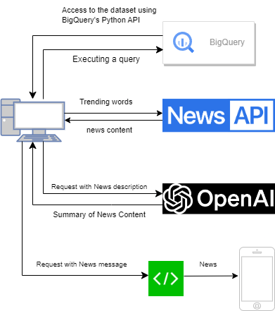

# News Trends Analysis Project

## 概要
`news_trends_analysis`は、日本の最新の検索トレンドに基づいてニュースを分析し、それらをLINEボットを通じて共有するPythonプロジェクトです。このプロジェクトは、日々の検索トレンドを集め関連するニュース記事を抽出し、処理してレポートを作成し、ユーザーが最新の情報を簡単かつ効率的にアクセスできるようにすることを目的としています。


## 特徴
- 日本国内のトレンドキーワードを抽出
- 関連するニュース記事の検索と分析
- LINEボットを介したレポートの共有

## プロジェクトの構成

プロジェクトの構成図は以下の通りです。構成図では、プロジェクトの主要コンポーネントとそれらの相互関係を示しています。



## 前提条件
- Python 3.8 以上

## セットアップ
1. リポジトリをクローンする:
   ```
   git clone https://github.com/yourusername/news_trends_analysis.git
   ```
2. 依存関係をインストールする:
   ```
   cd news_trends_analysis
   ...
   ```

## 使用方法
1. 日々のトレンドレポートを生成する:
   ```
   python src/scripts/daily_japan_trends_to_news_report.py
   ```
2. LINEボットを介してレポートを送信する:
   ```
   python src/scripts/line_messenger.py
   ```
3. または、1と2をbatファイルでまとめて実行する
   ```
   run_scripts.bat
   ```

## ライセンス
このプロジェクトは[MIT License](LICENSE)の下で公開されています。